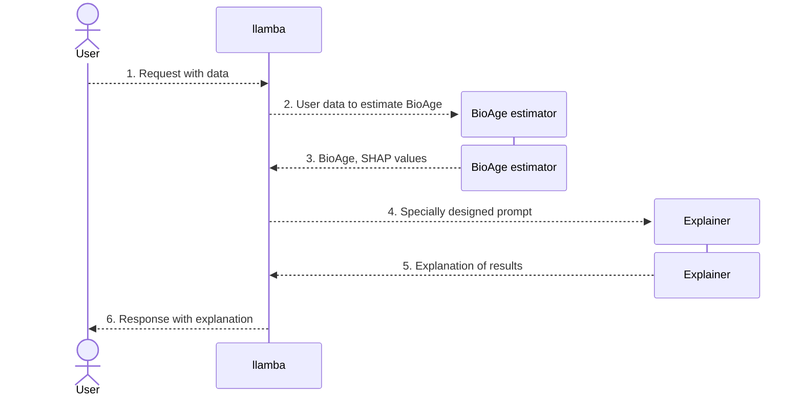

# llamba &mdash; a bridge between a BioAge estimator and explainer


## What is it?
**llamba** is a Python package that acts as a connector between a model that estimates a person's biological age and a chat model that explains the results. It is developed in order to provide more clarity to users of various BioAge predictors.



The diagram above explains the expected workflow of llamba:

1. User creates a request providing his sample data, a model to use, and a dataset on which the model was trained.
2. llamba runs a BioAge estimation model inference.
3. llamba receives BioAge along with SHAP values which are filtered to just 5 most influential features.
4. llamba designs a special prompt that asks Explainer (a specially-trained LLM model) to describe the results. A prompt may look like so: `What is X? What does an increased level of X mean?`, where X is a feature.
5. Explainer returns the explanation with some information about the most important features.
6. User receives an explanation with some graphs which demonstrate how his result compares with other peoples'.

This is the framework part of llamba that is responsible for communication with an LLM.

## Table of contents

- [Main Features](#main-features)
- [Installation](#installation)
- [Usage](#usage)
- [TODO](#todo)
- [License](#license)

## Main features

- Supports various BioAge estimation models due to a special wrapper class that requires the model to implement necessary methods.
- Supports various chatbot explainers.
- Has an ability to show graphs where users can see their results compared to other participants.

## Installation

You can download the sources and install them via Poetry by running the following command in the library's root directory:

`poetry install`

## Usage

### Test

To test that the library works, you can run the following [notebook sample](./samples/framework-in-use.ipynb):

```python
# Choosing an LLM
from llamba_framework.chatmodels.chatbase import ChatbaseModel # Another option -- `OllamaModel` -- is located in ollama.py
import config

chat_model = ChatbaseModel(url=config.URL_CB, api_key=config.API_KEY_CB, chatbot_id=config.ID_CB)

# LLM prompt creation
feat = 'C-reactive protein' # obtained from library
level = 'increased'# obtained from library

prompt = f'What is {feat}? What does {level} level of {feat} mean?'

# API request sending
chat_model.query(prompt=prompt, timeout=60)[1]
```

## TODO

1. Add a wrapper for a locally stored model (huggingface integration).
2. Add a wrapper for ChatGPT.
3. Provide more configurability for all the wrappers.

## License

Under construction.
